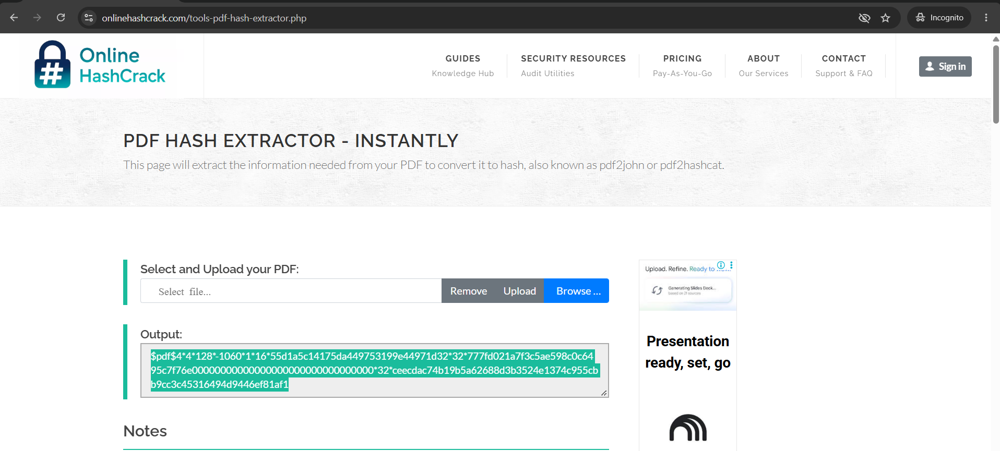
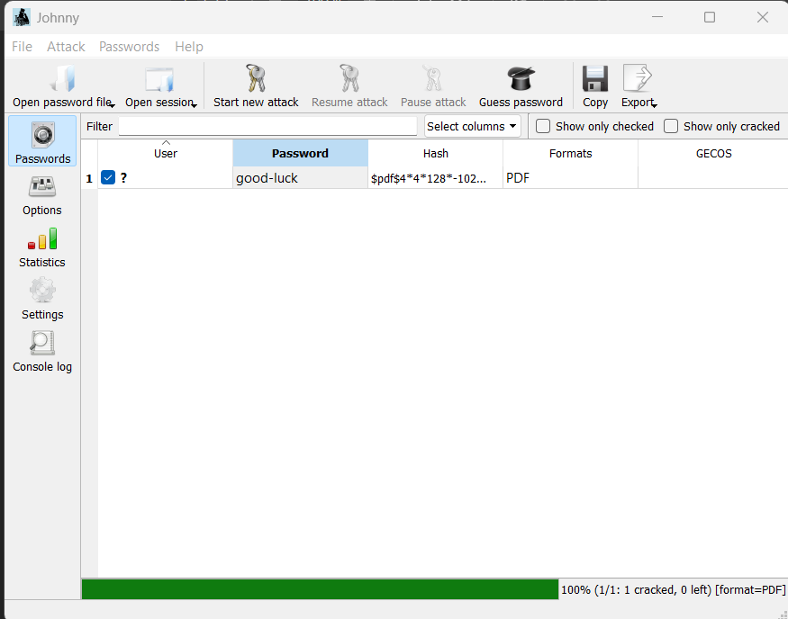
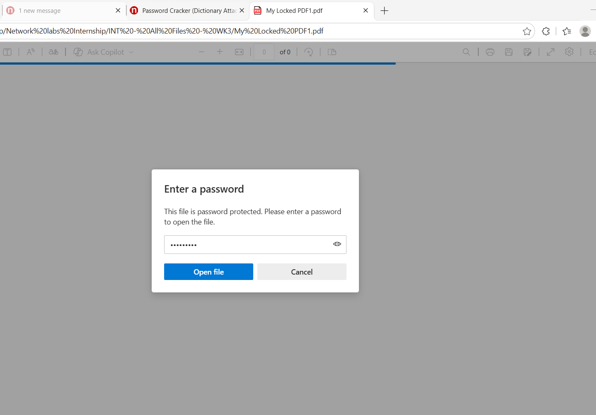
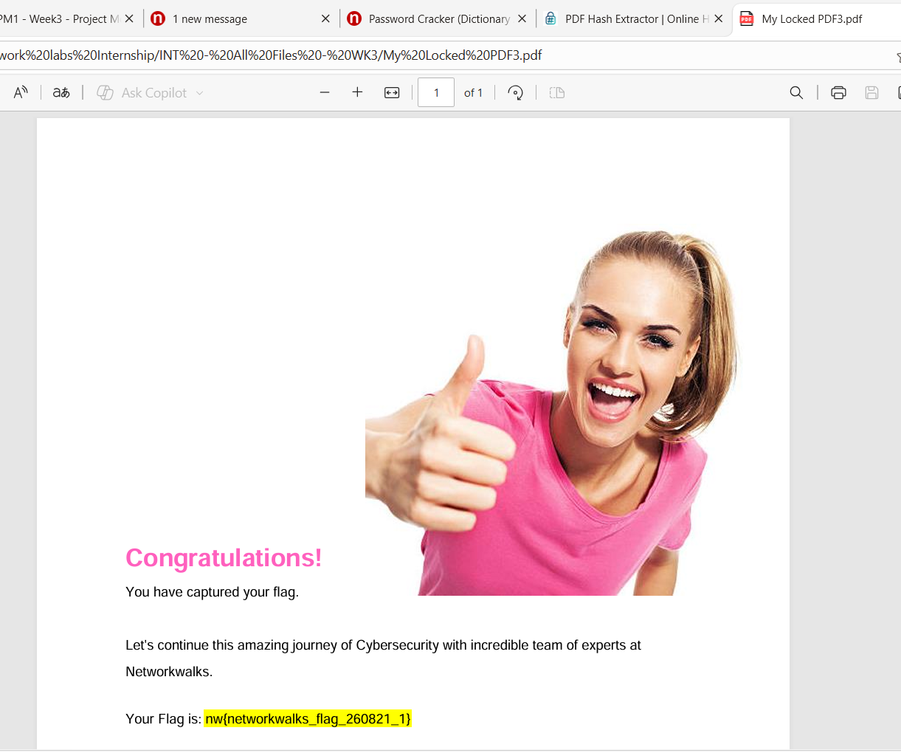
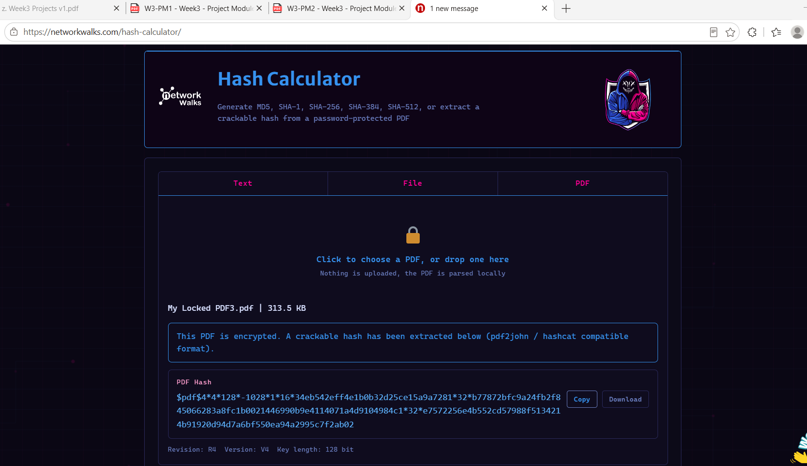
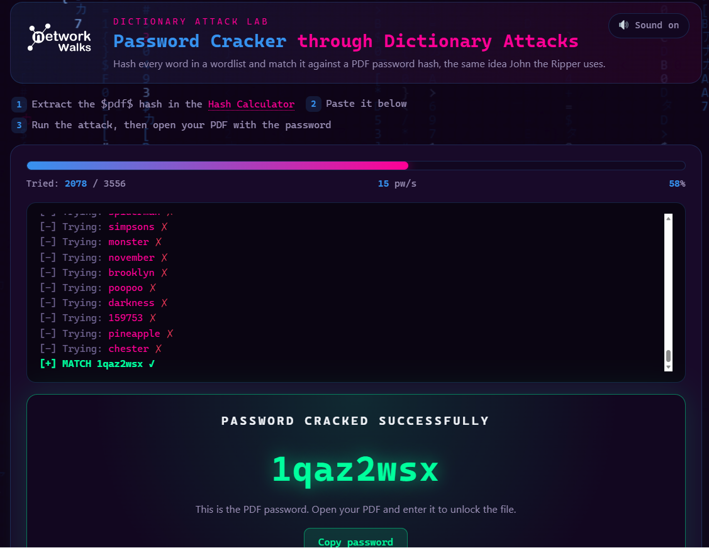
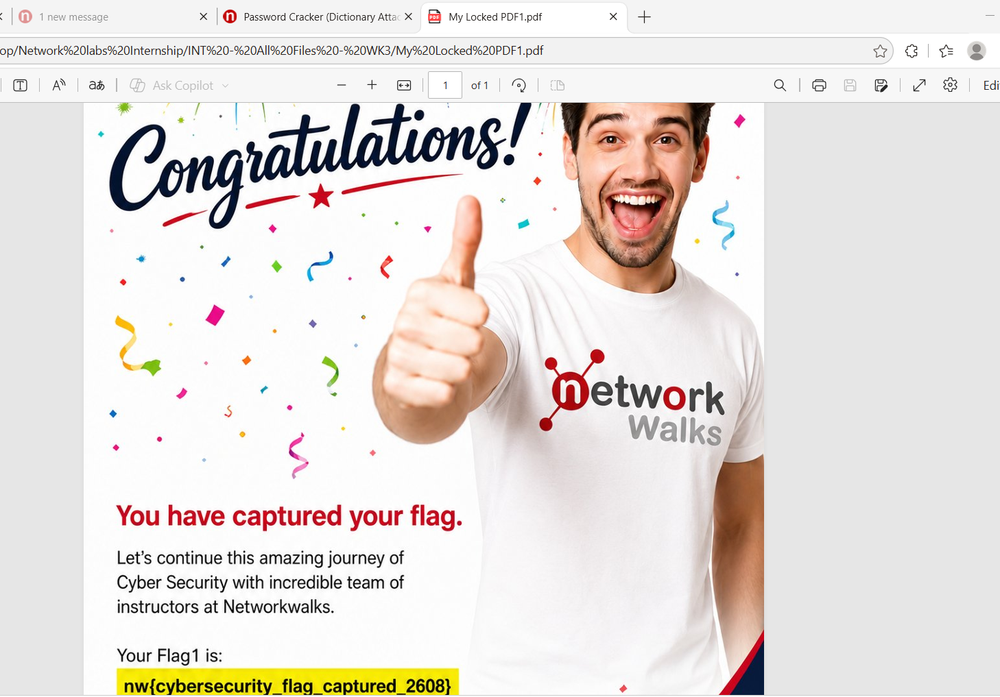

# Week 3 – Password Cracking Using John the Ripper & Networkwalks Tools

> Cybersecurity Internship – Networkwalks  

> Week 2 Practical Project

---

## Project Overview

As part of my week 3 cybersecurity internship with Networkwalks, I completed a
practical password-cracking exercise using:

- John the Ripper
- Johnny (GUI for John the Ripper)
- Networkwalks Hash Calculator
- Networkwalks Password Cracker

The objective of this exercise was to understand how password-protected PDF files
can be assessed using hash extraction and dictionary-based password cracking
techniques in a controlled cybersecurity lab environment.

The exercise was performed against a **lab-provided password-protected PDF file**
for educational purposes.

---

# Objectives

The main objectives of this exercise were to:

- Install and configure John the Ripper.
- Understand the role of Johnny as a graphical interface for John the Ripper.
- Understand how password-protected PDF files are represented as crackable hashes.
- Extract a PDF password hash.
- Use John the Ripper/Johnny to perform password cracking.
- Use the Networkwalks Hash Calculator to extract a PDF hash.
- Use the Networkwalks Password Cracker to perform a dictionary attack.
- Use the recovered password to unlock the protected PDF.
- Capture the lab flag after successfully opening the PDF.

---

# Tools Used

| Tool | Purpose |
|------|---------|
| John the Ripper | Password hash cracking |
| Johnny | Graphical interface for John the Ripper |
| Networkwalks Hash Calculator | PDF hash extraction |
| Networkwalks Password Cracker | Dictionary-based password cracking |
| Password-Protected PDF | Lab target |

---

# Scope & Authorization

This exercise was performed as part of the Networkwalks cybersecurity
internship using a lab-provided password-protected PDF.

```text
Purpose: Educational cybersecurity lab

Target: Lab-provided password-protected PDF

Testing Type:Password Hash Extraction & Dictionary Attack
```

---

## Activity - 1

### Step-1 Download and install John the Ripper & Johnny

Download and install John the Ripper from official website on your windows PC: 

https://www.openwall.com/john/ or https://distro.ibiblio.org/openwall/projects/john/1.9.0/ 

Download Johnny GUI from official website: 

https://openwall.info/wiki/john/johnny

----

### step-2 Password Cracking Using John the Ripper

The first approach used John the Ripper/Johnny to crack the password of the lab-provided protected PDF.

The overall workflow:

Password-Protected PDF --> Extract PDF Hash --> Save Hash to .txt --> Johnny --> Dictionary Attack --> Password Recovered --> Open PDF --> Capture Flag

### Obtain the PDF Hash

Hashing: Hashing is the process of turning any input data—like a text string, password, or file—into a short, fixed-length string of characters using a mathematical formula called a hash function. It acts as a unique digital fingerprint; changing even a single character in the input data creates a completely different output.

The onlinehash cracker was opened in a web browser.

Tool: https://www.onlinehashcrack.com/tools-pdf-hash-extractor.php

The password-protected PDF was selected and processed using the PDF option.

The Hash Calculator generated the hash.



The generated hash was copied and save a text (.txt) file.

### Load the Hash into Johnny

The .txt file is uploaded to Johnny.

John the Ripper cracked the password, the recovered password was used to open the password-protected PDF.

  

After unlocking the PDF, the lab flag was captured.



---

## Activity -2 

### Password cracking using Networkwalks Hash Calculator & Password Cracker

In this approach used the cybersecurity tools provided by Networkwalks:

Networkwalks Hash Calculator
Networkwalks Password Cracker

The Hash Calculator supports extracting a crackable hash from a
password-protected PDF. The processing is performed locally in the browser.

The Networkwalks Password Cracker performs a dictionary attack by comparing
hashed words from a wordlist against the extracted PDF password hash.

### Step 1 – Open Networkwalks Hash Calculator

The Networkwalks Hash Calculator was opened in a web browser.

Tool: https://networkwalks.com/hash-calculator/

The password-protected PDF was selected and processed using the PDF option.

The Hash Calculator generated the hash.



The generated hash was copied for use in the next step.

### Step 2 – Open Networkwalks Password Cracker

The Networkwalks Password Cracker was opened in the browser.

Tool: https://networkwalks.com/password-cracker/

The extracted PDF hash was pasted into the PDF hash field.

The tool uses a dictionary-attack approach to compare wordlist entries against the PDF password hash.

The password-cracking process was started using the available wordlist.

The tool cracked the password, the recovered password was used to open the password-protected PDF.



After unlocking the PDF, the lab flag was captured.



---

# Risk Anlysis/Impact

| Risk                    | Potential Impact                                             | Risk Level | Recommendation                                                  |
| ----------------------- | ------------------------------------------------------------ | ---------- | --------------------------------------------------------------- |
| Weak PDF password       | Password may be recovered through dictionary attacks.        | Medium     | Use long, unique, and complex passwords.                        |
| Common passwords        | Common words and passwords may be quickly identified.        | High       | Avoid dictionary words and commonly used passwords.             |
| Short passwords         | Smaller password combinations reduce cracking difficulty.    | High       | Use sufficiently long passwords with varied character types.    |
| Password hash exposure  | Obtaining a crackable hash enables offline password attacks. | High       | Protect password hashes and restrict access to sensitive files. |
| Password reuse          | A compromised password may expose other accounts or files.   | High       | Use unique passwords for different systems and files.           |

---

# Conclusion

This exercise demonstrated that password-protected files can be subjected
to offline password-guessing attacks when an attacker obtains a suitable
password hash.

Through this activity, I learned how to crack the password of the locked pdf file using various tools.

Password-protected file security | Password hashes | PDF hash extraction | John the Ripper | Johnny 
| Dictionary attacks | Password recovery | Importance of strong passwords

---

# Author

Nusi Parthasaradhi Reddy

Cybersecurity Trainee | LinkedIn: https://www.linkedin.com/in/nusi-parthasaradhi-reddy-13a6a8247/
